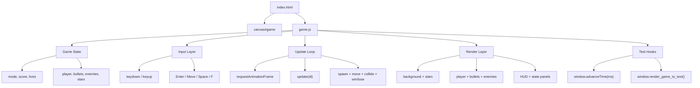

# Web Game: Zero Operation

## Run the game

1. Open a terminal in `D:\code\Python\web_game`.
2. Start a local static server:

```bash
python -m http.server 5173
```

3. Open your browser to:

```text
http://127.0.0.1:5173
```

4. Stop the server with `Ctrl + C` in the terminal.

## Controls

- `Enter`: Start / Restart
- `WASD` or Arrow keys: Move
- `Space` (hold): Continuous fire
- `Shift`: Boost movement speed while chasing
- `F`: Toggle fullscreen
- `Esc`: Exit fullscreen

## Progression

- Weapon upgrades unlock by score:
- `700`: `DUAL`
- `1700`: `TRIPLE`
- `3200`: `ACE WING`
- Enemy wave upgrades unlock by score:
- `1100`: `INTERCEPT WING` (faster interceptor enemies)
- `2500`: `SIEGE FLEET` (gunship enemies with enemy bullets)
- `4000`: `METEOR STORM` (meteor enemies with high HP/splitting pressure)
- `5600`: Victory
- Player collision now costs 1 life (with short invulnerability), instead of instant mission fail.

## Code Architecture

### File structure (core)

```text
web_game/
├─ index.html        # Canvas container + page style + game.js entry
├─ game.js           # Full game loop, state, input, render, collision, hooks
├─ main.py           # Minimal Python entry (not used by browser runtime)
├─ test-actions.json # Playwright action bursts for automated gameplay checks
└─ output/web-game/  # Generated screenshots and text states from test runs
```

### Runtime flow


